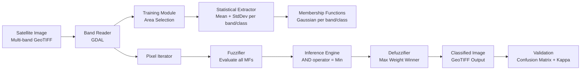

# FuzzySat

**Open-source satellite image classifier using Fuzzy Logic, built in C# / .NET 10**

[](https://dotnet.microsoft.com/)
[](LICENSE)
[]()
[]()

---

## Table of Contents

- [About](#about)
- [Motivation](#motivation)
- [Architecture](#architecture)
- [Project Structure](#project-structure)
- [Roadmap](#roadmap)
- [Benchmark Results](#benchmark-results)
- [Quick Start](#quick-start)
- [Supported Satellite Platforms](#supported-satellite-platforms)
- [Configuration](#configuration)
- [Contributing](#contributing)
- [Academic Citation](#academic-citation)
- [License](#license)

---

## About

FuzzySat is a modern, open-source reimplementation of a satellite image classifier originally
built in MATLAB in 2008. The classifier uses a **Fuzzy Inference System (FIS)** to categorize
each pixel of a multispectral satellite image into land cover classes (water, urban, scrubland,
bare soil, grassland, dense forest, medium forest, etc.) based on its spectral signature across
multiple bands.

Unlike black-box deep learning approaches, FuzzySat provides **explainable classifications** --
you can inspect every membership function, fuzzy rule, and firing weight that led to a
classification decision.

---

## Motivation

The original project was part of the thesis *"Desarrollo de un Clasificador de Imagenes
Satelitales Basado en Logica Difusa"* by Ivan R. J. Labrador Gonzalez at Universidad de Los
Andes, Merida, Venezuela (November 2008). It achieved **81.87% Overall Accuracy** against
ground truth, outperforming traditional classifiers on the same dataset.

The original stack (MATLAB + IDRISI) required expensive proprietary licenses. Today, the
entire pipeline can be replicated with free, open-source tools:

- Satellite imagery is freely available (Sentinel-2, Landsat 8/9)
- GDAL has mature .NET bindings for raster I/O
- The algorithms are well documented in the thesis
- .NET 10 provides excellent performance for pixel-level computation

---

## Architecture



### Classification Pipeline (per pixel)

1. **Read** the pixel's value from each spectral band (e.g., 4 bands = 4 input values)
2. **Fuzzify** each value using Gaussian membership functions (one per class per band)
3. **Evaluate** all fuzzy rules (one rule per land cover class, AND = minimum operator)
4. **Defuzzify** using the custom max weight method to assign the pixel to a class

The **max weight defuzzification** is the key innovation from the original thesis -- it
eliminates the class-ordering dependency of standard Sugeno weighted average defuzzification.

---

## Project Structure

```
FuzzySat/
├── FuzzySat.slnx
├── CLAUDE.md                          # AI assistant configuration
├── README.md                          # This file
├── LICENSE                            # MIT
├── .gitignore
│
├── src/
│   ├── FuzzySat.Core/                 # Core library (all algorithms)
│   │   ├── FuzzyLogic/                # Membership functions, rules, inference
│   │   ├── Raster/                    # GDAL-based raster I/O
│   │   ├── Classification/            # Classifier orchestration
│   │   ├── Training/                  # Training area extraction, statistics
│   │   ├── Validation/                # Confusion matrix, Kappa, accuracy
│   │   ├── Visualization/             # False color, classified rendering
│   │   └── Configuration/             # JSON config models
│   ├── FuzzySat.CLI/                  # Command-line tool
│   ├── FuzzySat.Api/                  # REST API
│   └── FuzzySat.Web/                  # Blazor Server web application
│
├── tests/
│   └── FuzzySat.Core.Tests/           # Unit tests (xUnit + FluentAssertions)
│
├── samples/                           # Sample configurations
├── docs/                              # Documentation
│   ├── claude/                        # AI assistant rules
│   ├── epics/                         # Epic planning & tracking
│   ├── architecture/                  # Architecture decisions
│   ├── development/                   # Development guides
│   └── troubleshooting/               # Known issues & solutions
│
├── task/                              # Progress tracking
│   └── todo.md                        # Central status file
│
└── .github/
    └── workflows/
        └── build.yml                  # CI/CD pipeline
```

---

## Roadmap

| Phase | Epic | Description | Status |
|-------|------|-------------|--------|
| 1 | Core Engine MVP | Fuzzy logic engine, membership functions, inference, defuzzifier, validation | Planned |
| 2 | I/O & CLI | GDAL raster reader/writer, CLI commands, JSON config persistence | Planned |
| 3 | Advanced Features | Additional MF types, spectral indices (NDVI, NDWI), PCA | Planned |
| 4 | ML Hybrid | ML.NET integration, hybrid fuzzy-ML classification | Planned |
| 5 | Blazor Web App | Interactive web UI with Leaflet.js maps, real-time classification | Planned |

**Priority**: Core engine (math) first, then GDAL I/O, CLI, and finally Blazor. The fuzzy
logic engine is the intellectual core and must work correctly before building any UI.

---

## Benchmark Results

### Original Thesis (2008) - ASTER Imagery, Merida, Venezuela

| Classifier | Overall Accuracy (%) | Kappa (%) |
|------------|---------------------|-----------|
| **Fuzzy Logic (ours)** | **81.87** | **76.37** |
| Maximum Likelihood | 74.27 | 66.50 |
| Decision Tree | 63.74 | 53.12 |
| Minimum Distance | 56.14 | 42.33 |

The goal of this reimplementation is to match or exceed these results on modern imagery
(Sentinel-2, Landsat 8/9).

---

## Quick Start

```bash
# Clone the repository
git clone https://github.com/ivanrlg/FuzzySat.git
cd FuzzySat

# Build
dotnet build

# Run tests
dotnet test

# Classify an image (CLI)
dotnet run --project src/FuzzySat.CLI -- classify \
    --config samples/sample_config.json \
    --session training_session.json \
    --output classified.tif

# Run the web application
dotnet run --project src/FuzzySat.Web
```

---

## Supported Satellite Platforms

| Platform | Bands | Resolution | Availability |
|----------|-------|-----------|-------------|
| ASTER | 14 (VNIR, SWIR, TIR) | 15-90m | NASA EarthData |
| Sentinel-2 | 13 (VNIR, Red Edge, SWIR) | 10-60m | Copernicus Open Access Hub |
| Landsat 8/9 | 11 (Coastal, VNIR, SWIR, TIR) | 15-100m | USGS EarthExplorer |
| Custom | Any number of bands | Any | User-provided GeoTIFF |

---

## Configuration

Classification is configured via JSON. See [samples/sample_config.json](samples/) for a
complete example.

```json
{
  "project": {
    "name": "Merida Classification",
    "description": "Land cover classification using ASTER imagery"
  },
  "bands": [
    { "index": 0, "name": "VNIR_Green", "wavelengthMin": 0.52, "wavelengthMax": 0.60 },
    { "index": 1, "name": "VNIR_Red", "wavelengthMin": 0.63, "wavelengthMax": 0.69 },
    { "index": 2, "name": "NIR", "wavelengthMin": 0.78, "wavelengthMax": 0.86 },
    { "index": 3, "name": "SWIR", "wavelengthMin": 1.60, "wavelengthMax": 1.70 }
  ],
  "classes": [
    { "id": 0, "name": "Water", "color": "#0000FF" },
    { "id": 1, "name": "Urban", "color": "#FF0000" }
  ],
  "classification": {
    "membershipFunction": "gaussian",
    "andOperator": "min",
    "defuzzificationMethod": "maxWeight"
  }
}
```

---

## Contributing

This project follows a structured development methodology documented in [CLAUDE.md](CLAUDE.md).

Key principles:
- **Micro-commits**: Each commit has a single objective, under 200 lines
- **PR review**: All PRs go through automated bot review before merge
- **Phase-based development**: Work is organized into Epics with defined scope
- **Test-driven**: Core algorithms must have unit tests with known values from the thesis

---

## Academic Citation

```bibtex
@thesis{labrador2008fuzzy,
  title     = {Desarrollo de un Clasificador de Imagenes Satelitales Basado en Logica Difusa},
  author    = {Labrador Gonzalez, Ivan Ramon Jose},
  year      = {2008},
  month     = {November},
  school    = {Universidad de Los Andes},
  address   = {Merida, Venezuela},
  type      = {Bachelor's Thesis},
  department= {Investigacion de Operaciones}
}
```

---

## License

This project is licensed under the MIT License - see the [LICENSE](LICENSE) file for details.

---

*Based on the original thesis (105 pages, November 2008). This reimplementation is designed
to bring fuzzy logic satellite classification to the open-source community with modern tools
and free data sources.*
