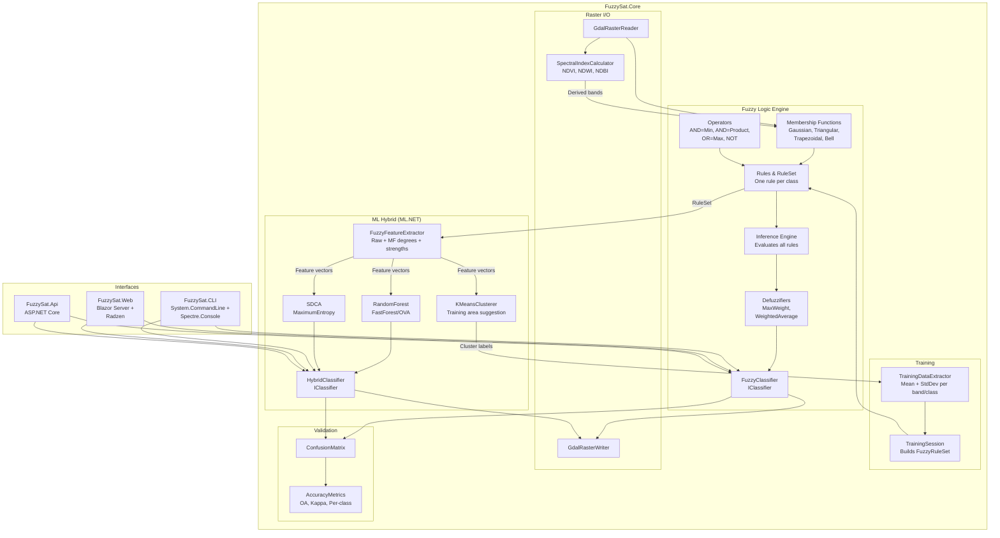
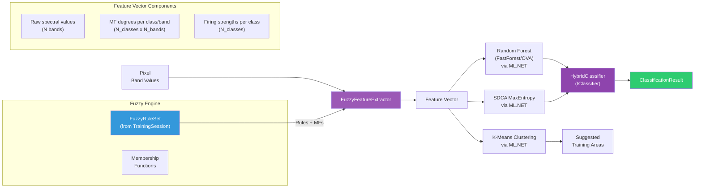

<div align="center">

# FuzzySat

**Satellite image classification powered by fuzzy logic inference**

A modern C#/.NET 10 reimplementation of a 2008 thesis that outperformed
Maximum Likelihood, Decision Tree, and Minimum Distance classifiers.


<a href="https://dotnet.microsoft.com/"></a>
<a href="LICENSE"></a>


</div>

---

## Highlights

| | |
|---|---|
| **81.87% Overall Accuracy** | Outperformed Maximum Likelihood by 7.6% on ASTER imagery |
| **4 Membership Functions** | Gaussian, Triangular, Trapezoidal, Generalized Bell |
| **Hybrid ML Pipeline** | ML.NET Random Forest + SDCA using fuzzy features |
| **GDAL Raster I/O** | Read GeoTIFF with geospatial metadata; write classified rasters |
| **260 Unit Tests** | 242 Core + 18 Web — mathematical correctness validated against thesis data |
| **Explainable AI** | Every membership degree and firing strength is inspectable |

---

## Listen: The FuzzySat Story (NotebookLM Podcasts)

> The full story of this project in podcast-style narratives generated with Google NotebookLM.

### English: The Resurrection

https://github.com/user-attachments/assets/d0927a55-e265-4e03-ad3b-e22915ba88a4

### Espanol: La Resurreccion

https://github.com/user-attachments/assets/e0f93bfc-7f02-4af7-876e-2a6649c89ad2

From a 2008 thesis archived in a Venezuelan university to a modern open-source tool --
these episodes cover the fuzzy logic engine, why pure fuzzy isn't enough in 2026,
how the hybrid ML.NET pipeline uses membership degrees as enriched features,
and the jump from ASTER (4 bands, 15m) to Sentinel-2 (13 bands, 10m).

*Scripts: [English](docs/SCRIPT_NOTEBOOKLM_EN.md) | [Espanol](docs/SCRIPT_NOTEBOOKLM.md)*

---

## About & Motivation

In 2008, a thesis at Universidad de Los Andes (Merida, Venezuela) proposed a fuzzy logic
classifier for satellite imagery. It achieved **81.87% Overall Accuracy**, outperforming
Maximum Likelihood, Decision Tree, and Minimum Distance classifiers on ASTER multispectral
data. But the implementation required MATLAB and IDRISI -- proprietary software costing
thousands of dollars. The thesis was archived. 105 pages of algorithms that nobody could
replicate without paying for licenses.

**18 years later**, everything that was expensive is now free:

| | 2008 | 2026 |
|:---|:---|:---|
| **Imagery** | ASTER (4 bands, 15m, restricted access) | Sentinel-2 (13 bands, 10m, free via [Copernicus](https://dataspace.copernicus.eu/)) |
| **Software** | MATLAB + IDRISI (proprietary) | C# / .NET 10 + GDAL (open source) |
| **ML** | Not integrated | ML.NET Random Forest + SDCA (free) |
| **Sharing** | Not possible | GitHub, MIT license, anyone can use it |

FuzzySat is a modern reimplementation of that thesis -- open, honest, and extensible.
The fuzzy logic engine is faithful to the original algorithm, and the hybrid ML pipeline
extends it with modern machine learning for improved accuracy.

---

## Table of Contents

- [Listen: FuzzySat — La Resurreccion](#listen-fuzzysat--la-resurreccion)
- [About & Motivation](#about--motivation)
- [Mathematical Foundation](#mathematical-foundation)
- [Architecture](#architecture)
- [Classification Pipeline](#classification-pipeline)
- [Benchmark Results](#benchmark-results)
- [Limitations & Why Hybrid](#limitations--why-hybrid)
- [Quick Start](#quick-start)
- [Membership Functions](#membership-functions)
- [Spectral Indices](#spectral-indices)
- [Hybrid ML Pipeline](#hybrid-ml-pipeline)
- [CLI Reference](#cli-reference)
- [Blazor Web Application](#blazor-web-application)
- [Tech Stack](#tech-stack)
- [API Quick Reference](#api-quick-reference)
- [Project Structure](#project-structure)
- [Academic Citation](#academic-citation)
- [Contributing](#contributing)
- [License](#license)

---

## Mathematical Foundation

### Gaussian Membership Function

The core building block maps a crisp spectral value to a degree of membership in [0, 1]:

$$\mu(x) = \exp\left(-\frac{1}{2}\left(\frac{x - c}{\sigma}\right)^2\right)$$

Where **c** = mean and **sigma** = standard deviation of training pixels for a given class and band.

### Fuzzy AND Operator (Minimum)

A pixel must satisfy **all** spectral bands to belong to a class. The firing strength is the minimum membership across bands:

$$\text{Strength}_{\text{class}} = \min_{b \in \text{bands}} \mu_{\text{class},b}(x_b)$$

An alternative **Product AND** is also available: $\prod_{b} \mu_{\text{class},b}(x_b)$

### Max Weight Defuzzification

The winning class is the one with the highest firing strength:

$$\text{Class}^* = \arg\max_{i} \text{Strength}_i$$

This eliminates the class-ordering dependency of Sugeno weighted-average methods.

### Cohen's Kappa Coefficient

Classification accuracy is assessed beyond simple percent-correct using:

$$\kappa = \frac{P_o - P_e}{1 - P_e}$$

Where $P_o$ is observed agreement (Overall Accuracy) and $P_e$ is expected agreement by chance.

---

## Architecture



---

## Classification Pipeline

```mermaid
flowchart LR
    A["GeoTIFF<br/>(Multi-band)"] -->|GDAL| B["MultispectralImage"]
    B -->|"Training Pixels"| C["TrainingDataExtractor<br/>Mean + sigma per class/band"]
    C --> D["TrainingSession"]
    D -->|"BuildRuleSet()"| E["FuzzyRuleSet<br/>(N rules, one per class)"]

    B -->|"Each Pixel"| F["Fuzzifier<br/>Evaluate all MFs"]
    E --> F
    F --> G["Inference Engine<br/>AND = min across bands"]
    G --> H["InferenceResult<br/>All firing strengths"]

    H --> I["MaxWeight<br/>Defuzzifier"]
    I --> J["ClassificationResult<br/>Class + Confidence map"]

    E -->|"RuleSet"| FE["FuzzyFeatureExtractor<br/>(ML.NET)"]
    FE -->|"Feature vectors"| ML["HybridClassifier<br/>RandomForest / SDCA"]
    ML --> J

    J -->|GDAL| K["Classified<br/>GeoTIFF"]
    J --> L["ConfusionMatrix<br/>OA + kappa"]

    style A fill:#4a90d9,color:#fff
    style K fill:#2ecc71,color:#fff
    style L fill:#e67e22,color:#fff
    style FE fill:#9b59b6,color:#fff
    style ML fill:#8e44ad,color:#fff
```



### Per-Pixel Classification (4 steps)

1. **Read** the pixel's spectral values across N bands
2. **Fuzzify** each value through Gaussian MFs (one per class per band)
3. **Infer** by evaluating all rules (AND = minimum across bands per class)
4. **Defuzzify** using Max Weight to assign the winning class

---

## Benchmark Results

### Original Thesis (2008) -- ASTER Imagery, Merida, Venezuela

| Classifier | Overall Accuracy | Kappa (kappa) | Improvement |
|:---|:---:|:---:|:---:|
| **Fuzzy Logic (FuzzySat)** | **81.87%** | **0.7637** | -- |
| Maximum Likelihood | 74.27% | 0.6650 | +7.60% |
| Decision Tree (CART) | 63.74% | 0.5312 | +18.13% |
| Minimum Distance | 56.14% | 0.4233 | +25.73% |

> The fuzzy classifier outperformed all traditional methods on 7 land cover classes
> using 4 ASTER spectral bands (VNIR1, VNIR2, SWIR1, SWIR2).

**Context**: These results were state-of-the-art for the methods compared in 2008.
Modern approaches like Convolutional Neural Networks (CNN) and Support Vector Machines (SVM)
can achieve 90-95% on similar tasks. FuzzySat addresses this gap through its
[hybrid ML pipeline](#hybrid-ml-pipeline), which uses fuzzy membership degrees as enriched
features for ML.NET classifiers.

---

## Limitations & Why Hybrid

### The Limitation of Pure Fuzzy Logic

The fuzzy classifier works well, but its decision mechanism is rigid: for each class,
take the **minimum** membership across all bands, then pick the class with the **highest
minimum**. This is a fixed rule -- it cannot learn complex inter-class patterns.

When two classes have similar spectral signatures (e.g., Agriculture vs. Grassland),
the firing strengths may differ by only 0.02. At that margin, noise in the data easily
flips the classification. Pure fuzzy logic has no way to learn that "when both classes
score above 0.7, look more carefully at SWIR1" -- it just picks the higher number.

### Why Fuzzy Logic Feeds ML (Not the Other Way Around)

A common question: if we're using Machine Learning anyway, why not skip fuzzy logic
and feed raw pixel values directly to a Random Forest?

You *can* do that. But the result is worse. Here's why:

A pixel with 4 spectral bands gives ML **4 numbers without context**. The algorithm
must discover on its own that 130 in VNIR1 is "typical Urban" and 75 is "typical Forest".

But if that pixel first passes through the fuzzy engine, you get **39 numbers with
context** (for 4 bands, 7 classes):

| Feature Group | Count | What it tells ML |
|:---|:---:|:---|
| Raw spectral values | 4 | The original measurements |
| Membership degrees (per class, per band) | 28 | "How much does this pixel look like Urban in VNIR1?" |
| Firing strengths (per class) | 7 | "Overall, how much does this pixel look like Urban?" |

It's the difference between giving a doctor just the numbers from a blood test,
versus giving the numbers **plus** an interpretation of each value (high, normal, low,
critical). With the interpretation included, better decisions follow.

**Fuzzy logic becomes an intelligent preprocessor** that enriches the data before
ML sees it. Two systems working together: one understands the physics of spectral
reflectance (fuzzy logic), the other finds complex statistical patterns (Random Forest).

---

## Quick Start

### Prerequisites

- [.NET 10 SDK](https://dotnet.microsoft.com/download/dotnet/10.0)
- GDAL native libraries (included via NuGet for Windows/Linux)

### Build & Test

```bash
git clone https://github.com/ivanrlg/FuzzySat.git
cd FuzzySat

dotnet build
dotnet test     # 260 tests
```

### CLI Usage

```bash
# Classify a raster image
dotnet run --project src/FuzzySat.CLI -- classify \
    --input data/aster-merida.tif \
    --model training-session.json \
    --output classified.tif

# Extract training statistics from labeled samples
dotnet run --project src/FuzzySat.CLI -- train \
    --samples training-areas.csv \
    --output training-session.json

# Validate classification accuracy (CSV: actual,predicted)
dotnet run --project src/FuzzySat.CLI -- validate \
    --truth ground-truth.csv

# Display raster metadata
dotnet run --project src/FuzzySat.CLI -- info data/aster-merida.tif
```

### Programmatic Usage (C#)

```csharp
using FuzzySat.Core.Training;
using FuzzySat.Core.FuzzyLogic.Inference;
using FuzzySat.Core.FuzzyLogic.Classification;
using FuzzySat.Core.Raster;

// 1. Train from labeled samples
var session = TrainingSession.CreateFromSamples(labeledPixels);

// 2. Build inference pipeline (uses GaussianMembershipFunction by default)
var ruleSet = session.BuildRuleSet();
var engine  = new FuzzyInferenceEngine(ruleSet);
var classifier = new FuzzyClassifier(engine);

// 3. Classify a pixel
string landCover = classifier.ClassifyPixel(new Dictionary<string, double>
{
    ["VNIR1"] = 128.0, ["VNIR2"] = 112.0,
    ["SWIR1"] = 158.0, ["SWIR2"] = 138.0
});
// => "Urban"

// 4. Classify an entire image
var reader = new GdalRasterReader();
var image  = reader.Read("aster-merida.tif", ["VNIR1", "VNIR2", "SWIR1", "SWIR2"]);
var result = ClassificationResult.ClassifyImage(image, engine, defuzzifier, classes);

// 5. Validate
var cm = new ConfusionMatrix(actualLabels, predictedLabels);
Console.WriteLine($"OA: {cm.OverallAccuracy:P2}, Kappa: {cm.KappaCoefficient:F4}");
```

---

## Membership Functions

FuzzySat implements four membership function types:

| Type | Formula | Shape | Use Case |
|:---|:---|:---:|:---|
| **Gaussian** | $\mu(x) = e^{-\frac{1}{2}\left(\frac{x-c}{\sigma}\right)^2}$ | Bell curve | Default (thesis algorithm) |
| **Triangular** | Linear rise/fall, peak at center | Triangle | Sharp class boundaries |
| **Trapezoidal** | Linear slopes with flat plateau | Trapezoid | Wide acceptance ranges |
| **Generalized Bell** | $\mu(x) = \frac{1}{1+\left\|\frac{x-c}{w}\right\|^{2s}}$ | Adjustable bell | Tunable steepness |

All implement `IMembershipFunction` and can be swapped programmatically. `TrainingSession.BuildRuleSet()` uses Gaussian by default.

---

## Spectral Indices

Derived bands using the normalized difference formula:

$$\text{NDI} = \frac{A - B}{A + B}$$

| Index | Formula | Detects | Typical Range |
|:---|:---|:---|:---:|
| **NDVI** | (NIR - Red) / (NIR + Red) | Vegetation vigor | -1 to +1 |
| **NDWI** | (Green - NIR) / (Green + NIR) | Water bodies | -1 to +1 |
| **NDBI** | (SWIR - NIR) / (SWIR + NIR) | Built-up areas | -1 to +1 |

```csharp
var ndvi = SpectralIndexCalculator.Ndvi(nirBand, redBand);
// ndvi is a Band that can be added to classification
```

---

## Hybrid ML Pipeline

FuzzySat bridges fuzzy logic and machine learning by using membership degrees as ML features:



The `FuzzyFeatureExtractor` uses the `FuzzyRuleSet` (built from training data) to produce an enriched feature vector:

| Feature Group | Count | Source |
|:---|:---:|:---|
| Raw spectral values | N_bands | Pixel band values |
| Membership degrees | N_classes x N_bands | Each MF evaluated on pixel |
| Firing strengths | N_classes | AND(min) across bands per class |
| **Total** | **N_bands + N_classes x (N_bands + 1)** | |

For 4 bands and 7 classes: 4 + 7 x 5 = **39 features** per pixel. This enriched representation bridges fuzzy logic and machine learning, often improving accuracy over raw spectral features alone.

---

## CLI Reference

| Command | Description |
|:---|:---|
| `dotnet run -- classify` | Classify a raster using a trained model |
| `dotnet run -- train` | Extract training statistics from labeled samples |
| `dotnet run -- validate` | Validate classification against ground truth |
| `dotnet run -- info <file>` | Display raster metadata (bands, dimensions, projection) |

Run from `src/FuzzySat.CLI/`. Built with [System.CommandLine](https://github.com/dotnet/command-line-api) 3.0 + [Spectre.Console](https://spectreconsole.net/) for rich terminal output.

---

## Blazor Web Application

FuzzySat includes a server-side Blazor web app with a wizard-flow interface:

| Page | Purpose |
|:---|:---|
| **Home** | Project overview and workflow steps |
| **Project Setup** | Configure bands, define land cover classes, set I/O paths |
| **Band Viewer** | Real band statistics, histograms, and SkiaSharp grayscale previews |
| **Training** | Draw training areas and extract spectral statistics |
| **Classification** | Configure MF type, AND operator, defuzzifier; run with progress bar |
| **Validation** | View Overall Accuracy, Kappa, per-class producer's/user's accuracy |

Built with [Radzen Blazor](https://blazor.radzen.com/) components.

```bash
dotnet run --project src/FuzzySat.Web
# Open https://localhost:5001
```

---

## Tech Stack

| Component | Technology | Version |
|:---|:---|:---:|
| **Framework** | .NET | 10.0 (LTS) |
| **Language** | C# | 13 |
| **Raster I/O** | GDAL via MaxRev.Gdal.Core | 3.12.2 |
| **ML** | Microsoft.ML + FastTree | 5.0.0 |
| **CLI** | System.CommandLine | 3.0.0-preview |
| **Terminal UI** | Spectre.Console | 0.54.0 |
| **Web UI** | Blazor Server + Radzen | 10.0.6 |
| **Tests** | xUnit + FluentAssertions | 2.9.3 / 8.9.0 |

---

## API Quick Reference

<details>
<summary><strong>Fuzzy Logic Engine</strong></summary>

| Type | Namespace | Purpose |
|:---|:---|:---|
| `IMembershipFunction` | `Core.FuzzyLogic.MembershipFunctions` | MF contract: `Evaluate(x) -> [0,1]` |
| `GaussianMembershipFunction` | `Core.FuzzyLogic.MembershipFunctions` | Gaussian bell curve |
| `TriangularMembershipFunction` | `Core.FuzzyLogic.MembershipFunctions` | Linear triangle |
| `TrapezoidalMembershipFunction` | `Core.FuzzyLogic.MembershipFunctions` | Flat-top trapezoid |
| `BellMembershipFunction` | `Core.FuzzyLogic.MembershipFunctions` | Generalized bell |
| `FuzzyRule` | `Core.FuzzyLogic.Rules` | One rule per class, N band MFs |
| `FuzzyRuleSet` | `Core.FuzzyLogic.Rules` | Collection with ordered evaluation |
| `FuzzyInferenceEngine` | `Core.FuzzyLogic.Inference` | Rule evaluation orchestrator |
| `InferenceResult` | `Core.FuzzyLogic.Inference` | Firing strengths + winner |
| `MaxWeightDefuzzifier` | `Core.FuzzyLogic.Defuzzification` | Winner-takes-all |
| `WeightedAverageDefuzzifier` | `Core.FuzzyLogic.Defuzzification` | Weighted index average |
| `FuzzyClassifier` | `Core.FuzzyLogic.Classification` | Single-call pixel classifier |
| `FuzzyOperators` | `Core.FuzzyLogic.Operators` | And, Or, Not, ProductAnd |

</details>

<details>
<summary><strong>Training & Validation</strong></summary>

| Type | Namespace | Purpose |
|:---|:---|:---|
| `TrainingDataExtractor` | `Core.Training` | Computes mean + stddev per class/band |
| `TrainingSession` | `Core.Training` | Bridges training data to FuzzyRuleSet |
| `SpectralStatistics` | `Core.Training` | Per-class statistics container |
| `ConfusionMatrix` | `Core.Validation` | NxN matrix with OA, Kappa, per-class |
| `AccuracyMetrics` | `Core.Validation` | Aggregated report from matrix |

</details>

<details>
<summary><strong>Raster & ML</strong></summary>

| Type | Namespace | Purpose |
|:---|:---|:---|
| `GdalRasterReader` | `Core.Raster` | Reads GeoTIFF to MultispectralImage |
| `GdalRasterWriter` | `Core.Raster` | Writes ClassificationResult as GeoTIFF |
| `SpectralIndexCalculator` | `Core.Raster` | NDVI, NDWI, NDBI derived bands |
| `HybridClassifier` | `Core.ML` | ML.NET with fuzzy features |
| `FuzzyFeatureExtractor` | `Core.ML` | Pixel to ML feature vector |
| `KMeansClusterer` | `Core.ML` | Unsupervised training area suggestion |

</details>

---

## Project Structure

```
FuzzySat/
├── FuzzySat.slnx                          # Solution file (.NET 10)
├── src/
│   ├── FuzzySat.Core/                     # Core library (all algorithms)
│   │   ├── FuzzyLogic/
│   │   │   ├── MembershipFunctions/       # Gaussian, Triangular, Trapezoidal, Bell
│   │   │   ├── Rules/                     # FuzzyRule, FuzzyRuleSet
│   │   │   ├── Inference/                 # FuzzyInferenceEngine, InferenceResult
│   │   │   ├── Defuzzification/           # MaxWeight, WeightedAverage
│   │   │   ├── Classification/            # FuzzyClassifier (IClassifier)
│   │   │   └── Operators/                 # And, Or, Not, ProductAnd
│   │   ├── Training/                      # TrainingSession, SpectralStatistics
│   │   ├── Raster/                        # GDAL reader/writer, Band, SpectralIndices
│   │   ├── Classification/                # ClassificationResult, ConfidenceMap
│   │   ├── Validation/                    # ConfusionMatrix, AccuracyMetrics, Kappa
│   │   ├── ML/                            # HybridClassifier, KMeans, FeatureExtractor
│   │   └── Configuration/                 # BandConfig, ClassifierConfig (JSON)
│   ├── FuzzySat.CLI/                      # Command-line tool (4 commands)
│   ├── FuzzySat.Api/                      # REST API (ASP.NET Core)
│   └── FuzzySat.Web/                      # Blazor Server (6 pages, Radzen UI)
├── tests/
│   ├── FuzzySat.Core.Tests/               # 242 unit tests (xUnit + FluentAssertions)
│   └── FuzzySat.Web.Tests/                # 18 service tests (security, raster, statistics)
├── samples/
│   └── sample-project.json                # ASTER Merida configuration example
└── docs/                                  # Epic planning, architecture, troubleshooting
```

---

## Supported Satellite Platforms

| Platform | Bands | Resolution | Availability |
|:---|:---:|:---:|:---|
| **ASTER** | 14 (VNIR, SWIR, TIR) | 15-90m | NASA EarthData |
| **Sentinel-2** | 13 (VNIR, Red Edge, SWIR) | 10-60m | Copernicus Open Access Hub |
| **Landsat 8/9** | 11 (Coastal, VNIR, SWIR, TIR) | 15-100m | USGS EarthExplorer |
| **Custom** | Any | Any | User-provided GeoTIFF |

---

## Academic Citation

```bibtex
@thesis{labrador2008fuzzy,
  title      = {Desarrollo de un Clasificador de Imagenes Satelitales
                Basado en Logica Difusa},
  author     = {Labrador Gonzalez, Ivan Ramon Jose},
  year       = {2008},
  month      = {November},
  school     = {Universidad de Los Andes},
  address    = {Merida, Venezuela},
  type       = {Bachelor's Thesis},
  department = {Investigacion de Operaciones},
  pages      = {105}
}
```

If you use FuzzySat in your research, please cite the original thesis and this repository.

---

## Contributing

FuzzySat follows a structured development methodology:

- **Micro-commits**: Each commit has a single objective, under 200 lines
- **PR review**: All PRs reviewed by automated bots (Copilot + Codex) before merge
- **Epic-based**: Work organized into 5 Epics with defined scope and acceptance criteria
- **Test-driven**: Core algorithms validated against known thesis values

See [CLAUDE.md](CLAUDE.md) for the complete development workflow.

---

## License

This project is licensed under the **MIT License** -- see [LICENSE](LICENSE) for details.

---

<p align="center">
  <em>
    Based on the original thesis (105 pages, November 2008).<br/>
    Reimplemented to bring fuzzy logic satellite classification<br/>
    to the open-source community with modern tools and free data.
  </em>
</p>
