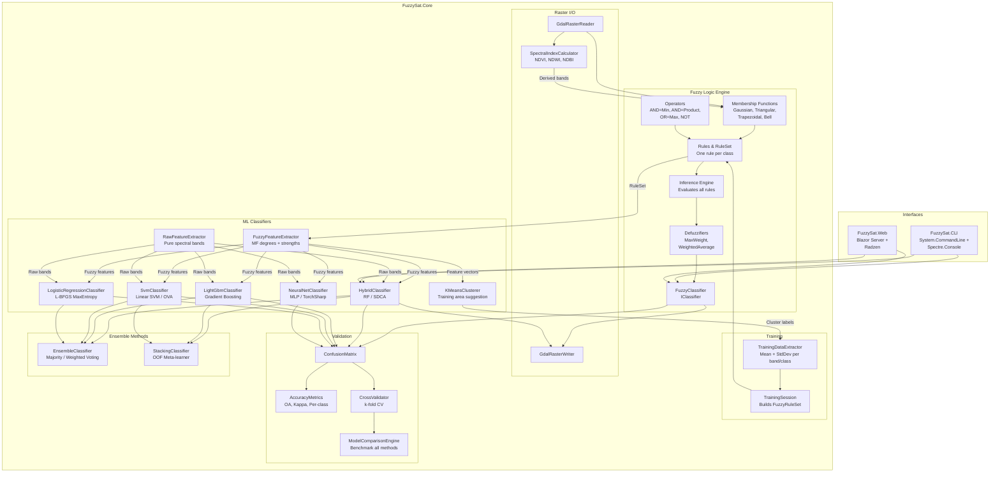
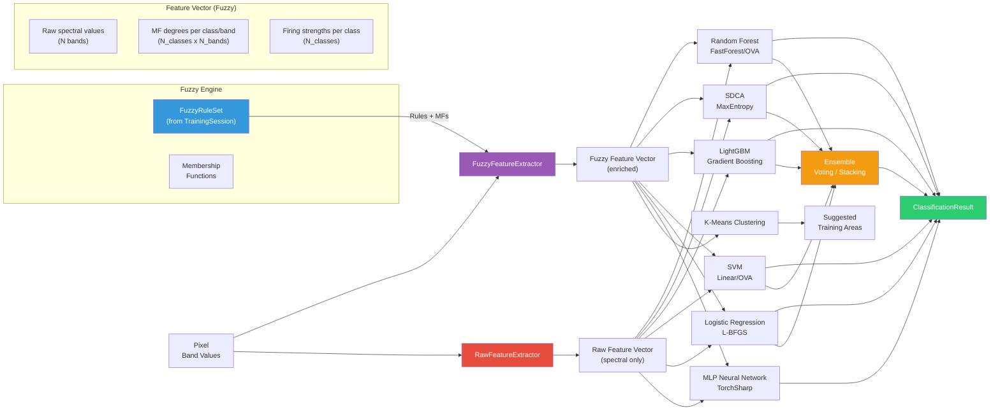

<div align="center">

# Terra ML

**Hybrid fuzzy logic + machine learning for satellite image classification**

A C#/.NET 10 platform combining fuzzy inference with modern ML classifiers
for multispectral satellite imagery.


<a href="https://dotnet.microsoft.com/"></a>
<a href="LICENSE"></a>


</div>

---

## Highlights

| | |
|---|---|
| **81.87% Overall Accuracy** | Fuzzy logic baseline from the [original thesis](docs/THESIS.md) (Kappa = 0.7637) |
| **3 Classification Modes** | Fuzzy logic, hybrid (fuzzy+ML), and pure ML |
| **6 ML Classifiers** | Random Forest, SDCA, LightGBM, SVM, Logistic Regression, MLP Neural Network |
| **4 Membership Functions** | Gaussian, Triangular, Trapezoidal, Generalized Bell |
| **Ensemble Methods** | Majority/weighted voting and stacking with meta-learner |
| **GDAL Raster I/O** | Read GeoTIFF with geospatial metadata; write classified rasters |
| **484 Unit Tests** | 349 Core + 119 Web + 16 CLI -- mathematical correctness validated |
| **Explainable AI** | Every membership degree and firing strength is inspectable |

---

## Table of Contents

- [Mathematical Foundation](#mathematical-foundation)
- [Architecture](#architecture)
- [Classification Pipeline](#classification-pipeline)
- [Limitations & Why Hybrid](#limitations--why-hybrid)
- [Quick Start](#quick-start)
- [Docker](#docker)
- [Membership Functions](#membership-functions)
- [Spectral Indices](#spectral-indices)
- [Hybrid ML Pipeline](#hybrid-ml-pipeline)
- [CLI Reference](#cli-reference)
- [Blazor Web Application](#blazor-web-application)
- [Tech Stack](#tech-stack)
- [API Quick Reference](#api-quick-reference)
- [Project Structure](#project-structure)
- [Supported Satellite Platforms](#supported-satellite-platforms)
- [Origin](#origin)
- [Contributing](#contributing)
- [License](#license)

---

## Mathematical Foundation

### Gaussian Membership Function

The core building block maps a crisp spectral value to a degree of membership in [0, 1]:

$$\mu(x) = \exp\left(-\frac{1}{2}\left(\frac{x - c}{\sigma}\right)^2\right)$$

Where **c** = mean and **sigma** = standard deviation of training pixels for a given class and band.

### Fuzzy AND Operator (Minimum)

A pixel must satisfy **all** spectral bands to belong to a class. The firing strength is the minimum membership across bands:

$$\text{Strength}_{\text{class}} = \min_{b \in \text{bands}} \mu_{\text{class},b}(x_b)$$

An alternative **Product AND** is also available: $\prod_{b} \mu_{\text{class},b}(x_b)$

### Max Weight Defuzzification

The winning class is the one with the highest firing strength:

$$\text{Class}^* = \arg\max_{i} \text{Strength}_i$$

This eliminates the class-ordering dependency of Sugeno weighted-average methods.

### Cohen's Kappa Coefficient

Classification accuracy is assessed beyond simple percent-correct using:

$$\kappa = \frac{P_o - P_e}{1 - P_e}$$

Where $P_o$ is observed agreement (Overall Accuracy) and $P_e$ is expected agreement by chance.

---

## Architecture



---

## Classification Pipeline

```mermaid
flowchart LR
    A["GeoTIFF<br/>(Multi-band)"] -->|GDAL| B["MultispectralImage"]
    B -->|"Training Pixels"| C["TrainingDataExtractor<br/>Mean + sigma per class/band"]
    C --> D["TrainingSession"]
    D -->|"BuildRuleSet()"| E["FuzzyRuleSet<br/>(N rules, one per class)"]

    B -->|"Each Pixel"| F["Fuzzifier<br/>Evaluate all MFs"]
    E --> F
    F --> G["Inference Engine<br/>AND = min across bands"]
    G --> H["InferenceResult<br/>All firing strengths"]

    H --> I["MaxWeight<br/>Defuzzifier"]
    I --> J["ClassificationResult<br/>Class + Confidence map"]

    E -->|"RuleSet"| FE["FuzzyFeatureExtractor"]
    B -->|"Raw bands"| RE["RawFeatureExtractor"]
    FE -->|"Fuzzy features"| ML["ML Classifiers<br/>RF, SDCA, LightGBM,<br/>SVM, LR, MLP"]
    RE -->|"Raw features"| ML
    ML --> J

    ML --> EN["Ensemble / Stacking"]
    EN --> J

    J -->|GDAL| K["Classified<br/>GeoTIFF"]
    J --> L["ConfusionMatrix<br/>OA + Kappa"]
    L --> CV["CrossValidator<br/>k-fold CV"]

    style A fill:#4a90d9,color:#fff
    style K fill:#2ecc71,color:#fff
    style L fill:#e67e22,color:#fff
    style FE fill:#9b59b6,color:#fff
    style RE fill:#e74c3c,color:#fff
    style ML fill:#8e44ad,color:#fff
    style EN fill:#f39c12,color:#fff
```



### Per-Pixel Classification (4 steps)

1. **Read** the pixel's spectral values across N bands
2. **Fuzzify** each value through Gaussian MFs (one per class per band)
3. **Infer** by evaluating all rules (AND = minimum across bands per class)
4. **Defuzzify** using Max Weight to assign the winning class

---

## Limitations & Why Hybrid

### The Limitation of Pure Fuzzy Logic

The fuzzy classifier works well, but its decision mechanism is rigid: for each class,
take the **minimum** membership across all bands, then pick the class with the **highest
minimum**. This is a fixed rule -- it cannot learn complex inter-class patterns.

When two classes have similar spectral signatures (e.g., Agriculture vs. Grassland),
the firing strengths may differ by only 0.02. At that margin, noise in the data easily
flips the classification. Pure fuzzy logic has no way to learn that "when both classes
score above 0.7, look more carefully at SWIR1" -- it just picks the higher number.

### Why Fuzzy Logic Feeds ML (Not the Other Way Around)

A common question: if we're using Machine Learning anyway, why not skip fuzzy logic
and feed raw pixel values directly to ML?

You *can* do that -- Terra ML supports both modes. But the hybrid approach often performs
better. Here's why:

A pixel with 4 spectral bands gives ML **4 numbers without context**. The algorithm
must discover on its own that 130 in VNIR1 is "typical Urban" and 75 is "typical Forest".

But if that pixel first passes through the fuzzy engine, you get **39 numbers with
context** (for 4 bands, 7 classes):

| Feature Group | Count | What it tells ML |
|:---|:---:|:---|
| Raw spectral values | 4 | The original measurements |
| Membership degrees (per class, per band) | 28 | "How much does this pixel look like Urban in VNIR1?" |
| Firing strengths (per class) | 7 | "Overall, how much does this pixel look like Urban?" |

It's the difference between giving a doctor just the numbers from a blood test,
versus giving the numbers **plus** an interpretation of each value (high, normal, low,
critical). With the interpretation included, better decisions follow.

**Fuzzy logic becomes an intelligent preprocessor** that enriches the data before
ML sees it. Two systems working together: one understands the physics of spectral
reflectance (fuzzy logic), the other finds complex statistical patterns (ML classifiers).

Terra ML includes a **Model Comparison** tool with k-fold cross-validation that lets
you benchmark all 6 classifiers (RF, SDCA, LightGBM, SVM, LR, MLP) in both hybrid and
pure ML modes side by side, so you can verify the benefit for your specific dataset.

---

## Quick Start

### Prerequisites

- [.NET 10 SDK](https://dotnet.microsoft.com/download/dotnet/10.0)
- GDAL native libraries (included via NuGet for Windows/Linux)

### Build & Test

```bash
git clone https://github.com/ivanrlg/TerraML.git
cd TerraML

dotnet build
dotnet test     # 484 tests
```

### CLI Usage

```bash
# Classify a raster image
dotnet run --project src/FuzzySat.CLI -- classify \
    --input data/aster-merida.tif \
    --model training-session.json \
    --output classified.tif

# Extract training statistics from labeled samples
dotnet run --project src/FuzzySat.CLI -- train \
    --samples training-areas.csv \
    --output training-session.json

# Validate classification accuracy (CSV: actual,predicted)
dotnet run --project src/FuzzySat.CLI -- validate \
    --truth ground-truth.csv

# Display raster metadata
dotnet run --project src/FuzzySat.CLI -- info data/aster-merida.tif
```

### Programmatic Usage (C#)

```csharp
using FuzzySat.Core.Training;
using FuzzySat.Core.FuzzyLogic.Inference;
using FuzzySat.Core.FuzzyLogic.Classification;
using FuzzySat.Core.Raster;

// 1. Train from labeled samples
var session = TrainingSession.CreateFromSamples(labeledPixels);

// 2. Build inference pipeline (uses GaussianMembershipFunction by default)
var ruleSet = session.BuildRuleSet();
var engine  = new FuzzyInferenceEngine(ruleSet);
var classifier = new FuzzyClassifier(engine);

// 3. Classify a pixel
string landCover = classifier.ClassifyPixel(new Dictionary<string, double>
{
    ["VNIR1"] = 128.0, ["VNIR2"] = 112.0,
    ["SWIR1"] = 158.0, ["SWIR2"] = 138.0
});
// => "Urban"

// 4. Classify an entire image
var reader = new GdalRasterReader();
var image  = reader.Read("aster-merida.tif", ["VNIR1", "VNIR2", "SWIR1", "SWIR2"]);
var result = ClassificationResult.ClassifyImage(image, engine, defuzzifier, classes);

// 5. Validate
var cm = new ConfusionMatrix(actualLabels, predictedLabels);
Console.WriteLine($"OA: {cm.OverallAccuracy:P2}, Kappa: {cm.KappaCoefficient:F4}");
```

---

## Docker

Run the web application with Docker -- no .NET SDK or GDAL installation required:

```bash
# Using Docker Compose (recommended)
docker compose up --build
# Open http://localhost:8080
```

Or build and run directly:

```bash
docker build -t terra-ml .
docker run -p 8080:8080 -v terra-ml-data:/app/data terra-ml
```

The `docker-compose.yml` mounts a named volume (`fuzzysat-data`) at `/app/data` for persistent project storage. The image uses a multi-stage build (SDK for compilation, ASP.NET runtime for execution) to keep the final image small.

---

## Membership Functions

Terra ML implements four membership function types:

| Type | Formula | Shape | Use Case |
|:---|:---|:---:|:---|
| **Gaussian** | $\mu(x) = e^{-\frac{1}{2}\left(\frac{x-c}{\sigma}\right)^2}$ | Bell curve | Default |
| **Triangular** | Linear rise/fall, peak at center | Triangle | Sharp class boundaries |
| **Trapezoidal** | Linear slopes with flat plateau | Trapezoid | Wide acceptance ranges |
| **Generalized Bell** | $\mu(x) = \frac{1}{1+\left\|\frac{x-c}{w}\right\|^{2s}}$ | Adjustable bell | Tunable steepness |

All implement `IMembershipFunction` and can be swapped programmatically. `TrainingSession.BuildRuleSet()` uses Gaussian by default.

---

## Spectral Indices

Derived bands using the normalized difference formula:

$$\text{NDI} = \frac{A - B}{A + B}$$

| Index | Formula | Detects | Typical Range |
|:---|:---|:---|:---:|
| **NDVI** | (NIR - Red) / (NIR + Red) | Vegetation vigor | -1 to +1 |
| **NDWI** | (Green - NIR) / (Green + NIR) | Water bodies | -1 to +1 |
| **NDBI** | (SWIR - NIR) / (SWIR + NIR) | Built-up areas | -1 to +1 |

```csharp
var ndvi = SpectralIndexCalculator.Ndvi(nirBand, redBand);
// ndvi is a Band that can be added to classification
```

---

## Hybrid ML Pipeline

Terra ML bridges fuzzy logic and machine learning by using membership degrees as ML features:



### Feature Extraction Modes

| Mode | Extractor | Features | Use Case |
|:---|:---|:---:|:---|
| **Hybrid** | `FuzzyFeatureExtractor` | N_bands + N_classes x (N_bands + 1) | Best accuracy -- fuzzy-enriched input |
| **Pure ML** | `RawFeatureExtractor` | N_bands | Baseline comparison -- raw spectral bands only |

For 4 bands and 7 classes, the fuzzy extractor produces 4 + 7 x 5 = **39 features** per pixel:

| Feature Group | Count | Source |
|:---|:---:|:---|
| Raw spectral values | N_bands | Pixel band values |
| Membership degrees | N_classes x N_bands | Each MF evaluated on pixel |
| Firing strengths | N_classes | AND(min) across bands per class |

### Available ML Classifiers

| Classifier | Backend | Strengths |
|:---|:---|:---|
| **Random Forest** | ML.NET FastForest/OVA | Robust, handles noise well |
| **SDCA** | ML.NET MaximumEntropy | Fast convergence, good for large datasets |
| **LightGBM** | ML.NET LightGBM | High accuracy, gradient boosting |
| **SVM** | ML.NET Linear SVM/OVA | Effective for high-dimensional data |
| **Logistic Regression** | ML.NET L-BFGS MaxEntropy | Calibrated probabilities |
| **MLP Neural Network** | TorchSharp | Deep learning, adaptive architecture |
| **Ensemble (Voting)** | Majority / weighted vote | Combines multiple classifiers |
| **Stacking** | OOF meta-learner (LogReg) | Learns optimal classifier combination |

All classifiers implement `IClassifier` and can be used interchangeably in the classification pipeline. The **Model Comparison** tool benchmarks all methods with k-fold cross-validation.

---

## CLI Reference

| Command | Description |
|:---|:---|
| `dotnet run -- classify` | Classify a raster using a trained model |
| `dotnet run -- train` | Extract training statistics from labeled samples |
| `dotnet run -- validate` | Validate classification against ground truth |
| `dotnet run -- info <file>` | Display raster metadata (bands, dimensions, projection) |
| `dotnet run -- visualize` | Render a false color composite PNG from a raster |

Run from `src/FuzzySat.CLI/`. Built with [System.CommandLine](https://github.com/dotnet/command-line-api) 3.0 + [Spectre.Console](https://spectreconsole.net/) for rich terminal output.

---

## Blazor Web Application

Terra ML includes a server-side Blazor web app with a wizard-flow interface:

| Page | Purpose |
|:---|:---|
| **Home** | Project overview and workflow steps |
| **Project Setup** | Configure bands, define land cover classes, set I/O paths |
| **Training** | Draw training areas, visualize bands, extract spectral statistics |
| **Classification** | Configure MF type, AND operator, defuzzifier; run with progress bar |
| **Validation** | View Overall Accuracy, Kappa, per-class producer's/user's accuracy |
| **Model Comparison** | Cross-validate and benchmark all classification methods |
| **History** | Browse, load, and manage saved projects |

Built with [Radzen Blazor](https://blazor.radzen.com/) components.

```bash
dotnet run --project src/FuzzySat.Web
# Open https://localhost:5001
```

---

## Tech Stack

| Component | Technology | Version |
|:---|:---|:---:|
| **Framework** | .NET | 10.0 (LTS) |
| **Language** | C# | 13 |
| **Raster I/O** | GDAL via MaxRev.Gdal.Core | 3.12.3 |
| **ML** | Microsoft.ML + FastTree + LightGBM | 5.0.0 |
| **Neural Network** | TorchSharp | 0.105.0 |
| **CLI** | System.CommandLine | 3.0.0-preview |
| **Terminal UI** | Spectre.Console | 0.54.0 |
| **Web UI** | Blazor Server + Radzen | 10.1.0 |
| **Tests** | xUnit + FluentAssertions | 2.9.3 / 8.9.0 |

---

## API Quick Reference

<details>
<summary><strong>Fuzzy Logic Engine</strong></summary>

| Type | Namespace | Purpose |
|:---|:---|:---|
| `IMembershipFunction` | `Core.FuzzyLogic.MembershipFunctions` | MF contract: `Evaluate(x) -> [0,1]` |
| `GaussianMembershipFunction` | `Core.FuzzyLogic.MembershipFunctions` | Gaussian bell curve |
| `TriangularMembershipFunction` | `Core.FuzzyLogic.MembershipFunctions` | Linear triangle |
| `TrapezoidalMembershipFunction` | `Core.FuzzyLogic.MembershipFunctions` | Flat-top trapezoid |
| `BellMembershipFunction` | `Core.FuzzyLogic.MembershipFunctions` | Generalized bell |
| `FuzzyRule` | `Core.FuzzyLogic.Rules` | One rule per class, N band MFs |
| `FuzzyRuleSet` | `Core.FuzzyLogic.Rules` | Collection with ordered evaluation |
| `FuzzyInferenceEngine` | `Core.FuzzyLogic.Inference` | Rule evaluation orchestrator |
| `InferenceResult` | `Core.FuzzyLogic.Inference` | Firing strengths + winner |
| `MaxWeightDefuzzifier` | `Core.FuzzyLogic.Defuzzification` | Winner-takes-all |
| `WeightedAverageDefuzzifier` | `Core.FuzzyLogic.Defuzzification` | Weighted index average |
| `FuzzyClassifier` | `Core.FuzzyLogic.Classification` | Single-call pixel classifier |
| `FuzzyOperators` | `Core.FuzzyLogic.Operators` | And, Or, Not, ProductAnd |

</details>

<details>
<summary><strong>Training & Validation</strong></summary>

| Type | Namespace | Purpose |
|:---|:---|:---|
| `TrainingDataExtractor` | `Core.Training` | Computes mean + stddev per class/band |
| `TrainingSession` | `Core.Training` | Bridges training data to FuzzyRuleSet |
| `SpectralStatistics` | `Core.Training` | Per-class statistics container |
| `ConfusionMatrix` | `Core.Validation` | NxN matrix with OA, Kappa, per-class |
| `AccuracyMetrics` | `Core.Validation` | Aggregated report from matrix |

</details>

<details>
<summary><strong>Raster I/O</strong></summary>

| Type | Namespace | Purpose |
|:---|:---|:---|
| `GdalRasterReader` | `Core.Raster` | Reads GeoTIFF to MultispectralImage |
| `GdalRasterWriter` | `Core.Raster` | Writes ClassificationResult as GeoTIFF |
| `SpectralIndexCalculator` | `Core.Raster` | NDVI, NDWI, NDBI derived bands |

</details>

<details>
<summary><strong>ML Classifiers & Ensemble</strong></summary>

| Type | Namespace | Purpose |
|:---|:---|:---|
| `HybridClassifier` | `Core.ML` | Random Forest / SDCA with fuzzy or raw features |
| `LightGbmClassifier` | `Core.ML` | LightGBM gradient boosting classifier |
| `SvmClassifier` | `Core.ML` | Linear SVM with One-vs-All strategy |
| `LogisticRegressionClassifier` | `Core.ML` | L-BFGS Maximum Entropy classifier |
| `NeuralNetClassifier` | `Core.ML` | MLP Neural Network via TorchSharp |
| `EnsembleClassifier` | `Core.ML` | Majority / weighted voting ensemble |
| `StackingClassifier` | `Core.ML` | Out-of-fold stacking with meta-learner |
| `FuzzyFeatureExtractor` | `Core.ML` | Pixel to fuzzy-enriched feature vector |
| `RawFeatureExtractor` | `Core.ML` | Pixel to raw spectral feature vector |
| `KMeansClusterer` | `Core.ML` | Unsupervised training area suggestion |
| `ModelComparisonEngine` | `Core.ML` | Benchmark all classifiers with k-fold CV |
| `CrossValidator` | `Core.ML` | k-fold cross-validation evaluator |

</details>

---

## Project Structure

```
TerraML/
├── FuzzySat.slnx                          # Solution file (.NET 10)
├── Dockerfile                             # Multi-stage Docker build (SDK → ASP.NET runtime)
├── docker-compose.yml                     # One-command deployment with data volume
├── src/
│   ├── FuzzySat.Core/                     # Core library (all algorithms)
│   │   ├── FuzzyLogic/
│   │   │   ├── MembershipFunctions/       # Gaussian, Triangular, Trapezoidal, Bell
│   │   │   ├── Rules/                     # FuzzyRule, FuzzyRuleSet
│   │   │   ├── Inference/                 # FuzzyInferenceEngine, InferenceResult
│   │   │   ├── Defuzzification/           # MaxWeight, WeightedAverage
│   │   │   ├── Classification/            # FuzzyClassifier (IClassifier)
│   │   │   └── Operators/                 # And, Or, Not, ProductAnd
│   │   ├── Training/                      # TrainingSession, SpectralStatistics
│   │   ├── Raster/                        # GDAL reader/writer, Band, SpectralIndices
│   │   ├── Classification/                # ClassificationResult, ConfidenceMap
│   │   ├── Validation/                    # ConfusionMatrix, AccuracyMetrics, Kappa
│   │   ├── ML/                            # 6 classifiers, ensemble, stacking, CV
│   │   └── Configuration/                 # BandConfig, ClassifierConfig (JSON)
│   ├── FuzzySat.CLI/                      # Command-line tool (5 commands)
│   └── FuzzySat.Web/                      # Blazor Server (7 pages, Radzen UI)
├── tests/
│   ├── FuzzySat.Core.Tests/               # Core unit tests (xUnit + FluentAssertions)
│   ├── FuzzySat.CLI.Tests/                # CLI command tests
│   └── FuzzySat.Web.Tests/                # Web service tests
├── samples/
│   └── sample-project.json                # ASTER Merida configuration example
└── docs/                                  # Epic planning, architecture, troubleshooting
```

---

## Supported Satellite Platforms

| Platform | Bands | Resolution | Availability |
|:---|:---:|:---:|:---|
| **ASTER** | 14 (VNIR, SWIR, TIR) | 15-90m | NASA EarthData |
| **Sentinel-2** | 13 (VNIR, Red Edge, SWIR) | 10-60m | Copernicus Open Access Hub |
| **Landsat 8/9** | 11 (Coastal, VNIR, SWIR, TIR) | 15-100m | USGS EarthExplorer |
| **Custom** | Any | Any | User-provided GeoTIFF |

---

## Origin

This project was inspired by a [2008 undergraduate thesis](docs/THESIS.md) on fuzzy logic
satellite image classification at Universidad de Los Andes, Venezuela. The original concept
has been significantly extended with modern ML classifiers, multiple membership function types,
Sentinel-2 support, and open-source tooling.

---

## Contributing

Terra ML follows a structured development methodology:

- **Micro-commits**: Each commit has a single objective, under 200 lines
- **PR review**: All PRs reviewed by automated bots (Claude Code Review + GitHub Copilot) before merge
- **Epic-based**: Work organized into 5 Epics with defined scope and acceptance criteria
- **Test-driven**: Core algorithms validated against known mathematical results

See [CLAUDE.md](CLAUDE.md) for the complete development workflow.

---

## License

This project is licensed under the **MIT License** -- see [LICENSE](LICENSE) for details.
